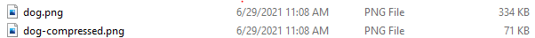
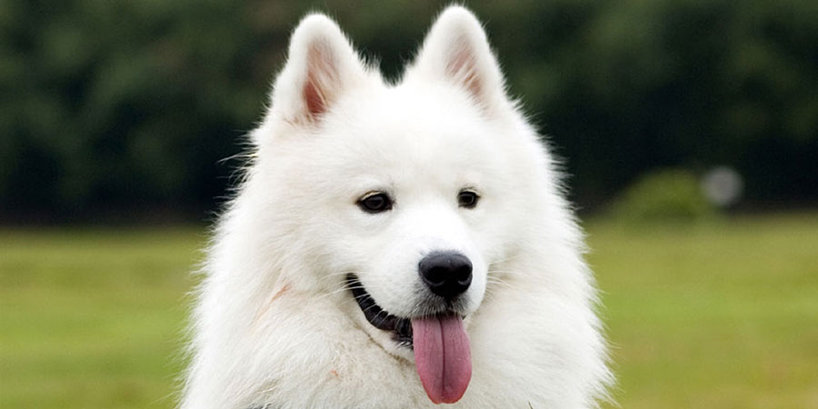
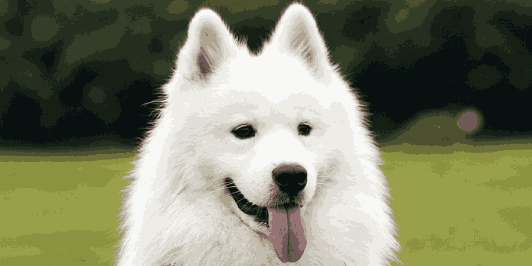

# AI_DataScience_ML

## Image Compression using K-Means algorithm.

The script uses K-Means, a Machine Learning clustering algorithm, to cluster all the colors in an image into 16 clusters and replace the RGB value of every pixel with the RGB value of their respective cluster center and thus reducing the amount of memory required to save a picture.

## Requirements

### Comparison

#### File sizes

 Original Image(dog.png)         |  Compressed Image(dog-compressed.png) 
-------------------------|-------------------------
 | 

### Requirements
- Python
- Scipy
- Numpy
- Matplotlib

### Instructions
- Download script.py in your required directory.
- Run python script.py _yourfilenamehere.png_ in your terminal.

### Note
> Use a .png file as JPEG uses lossy compression which may lead to undesired result.
